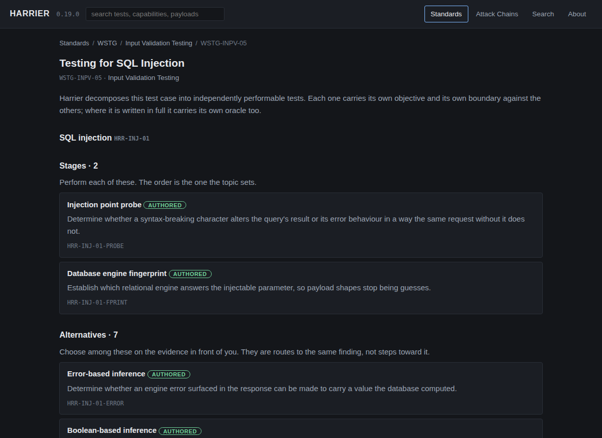
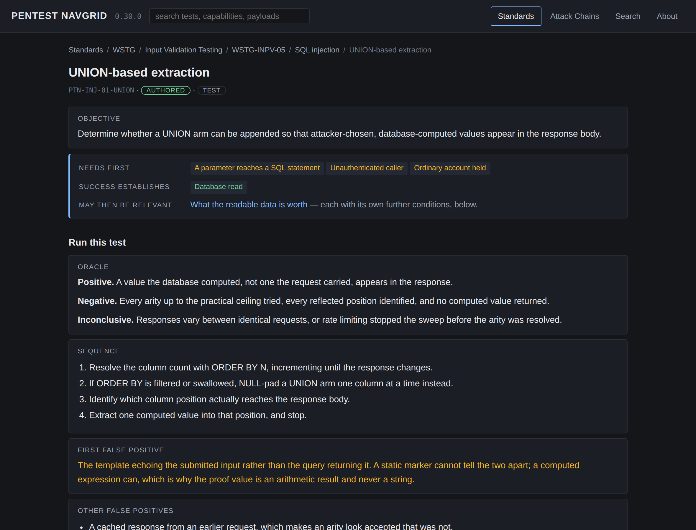
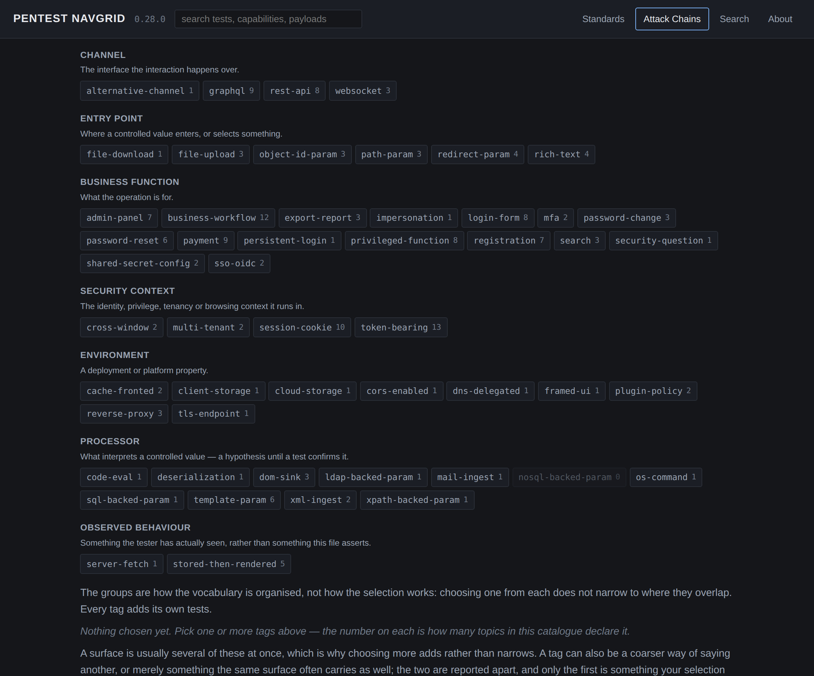
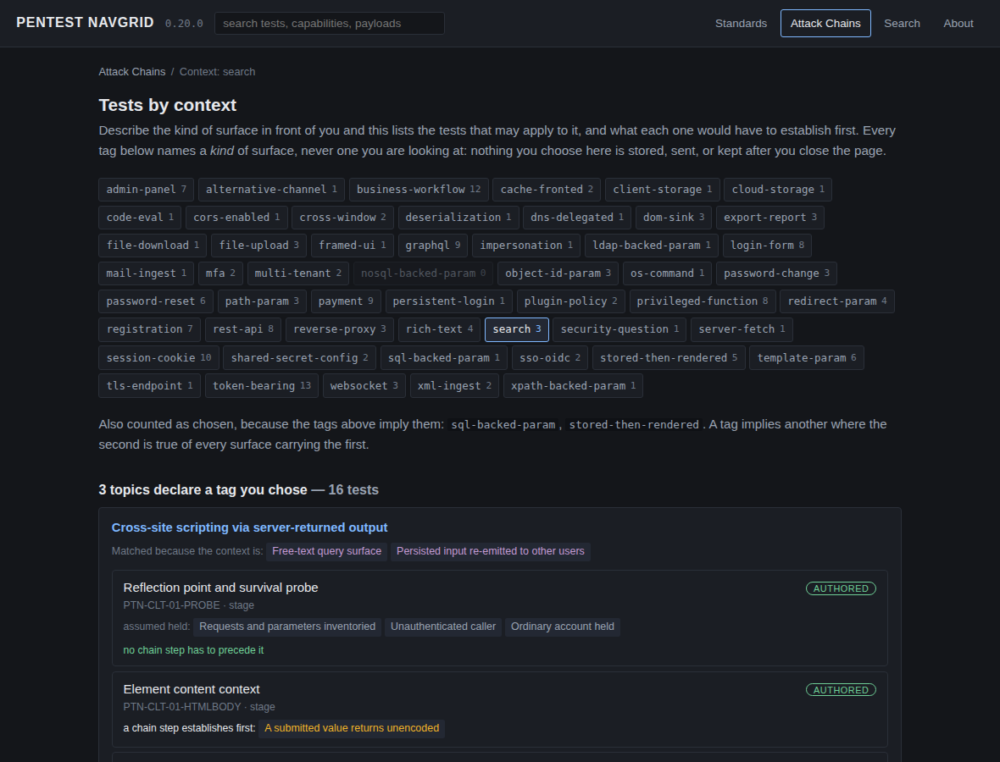
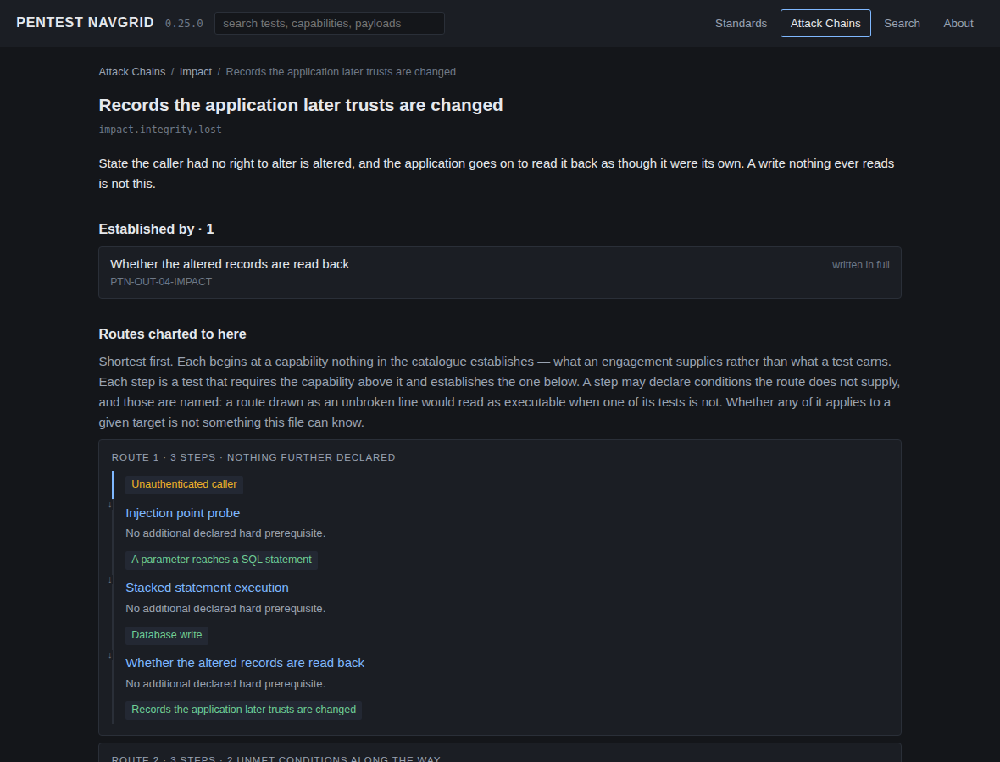
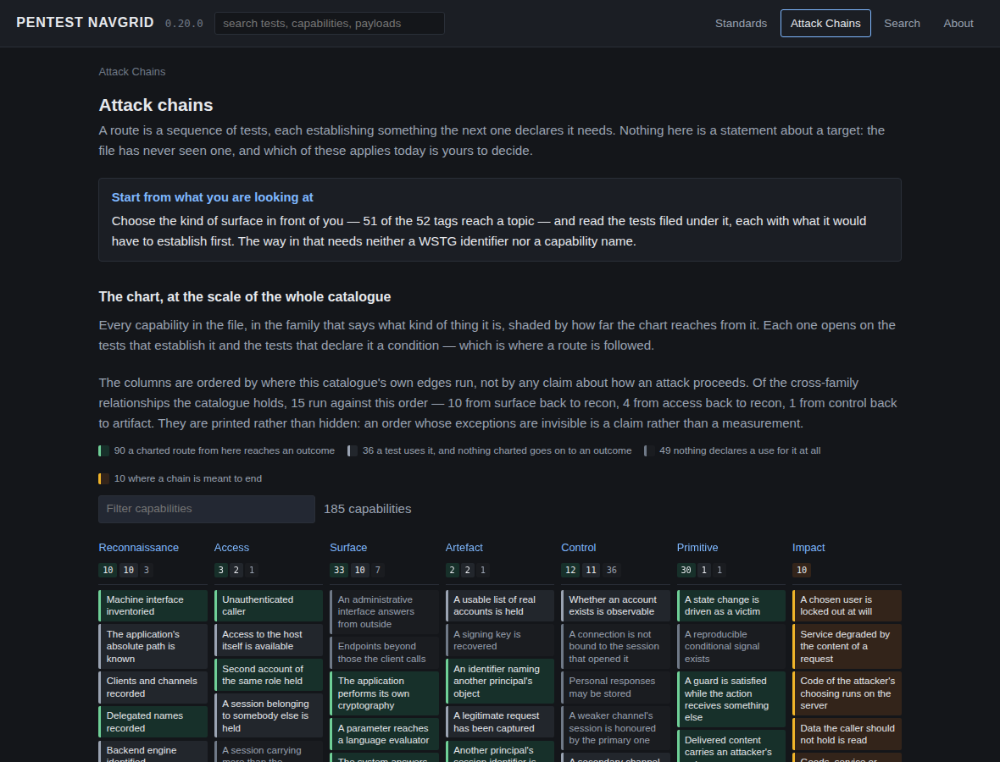

# Pentest NavGrid

**WSTG tells you what to cover. Pentest NavGrid shows you the real tests inside each
test case, and where a successful one may lead.**

An offline execution companion for web application security testing standards.
It breaks broad standard test cases into atomic, separately addressable **Test
Units**, and derives the attack-chain continuations each success may open.

> **Pentest NavGrid 0.28.0 is an early public alpha.** The WSTG decomposition is broad —
> every resolvable identifier is claimed, and 393 Test Units exist. The depth
> behind them is not: 36 units are written to full procedural depth and 40 are
> sketched, and what a defeated control permits is largely unwritten. [What that
> means in numbers](#what-exists-today-and-what-does-not) is below, not buried at
> the end.

[](LICENSE)
[](docs/ROADMAP.md)
[](standards/wstg.yaml)
[](standards/asvs.yaml)
[](standards/cwe.yaml)

---

## The problem

A testing standard is a coverage structure. It is very good at that, and WSTG in
particular is the reason nothing standard goes missing from a scope. But two
things a working tester needs sit outside what a coverage structure is for, and
Pentest NavGrid exists for exactly those two.

**A test case is not a test.** `WSTG-INPV-05` is one line on a checklist and ten
materially different tests in practice — a probe, an engine fingerprint, five
inference and extraction techniques, a stacked-statement variant, a second-order
variant, and a filter-evasion pass. Each has its own payloads, its own oracle,
and its own separately recordable result. A checklist that ticks once for all ten
can be complete while most of the work was never done, and nothing in it will say
so. Pentest NavGrid makes those tests explicit, individually named, and bounded against
each other.

**A result is not the end of the test.** Establishing that a parameter reaches a
SQL statement is not a finding on its own; it is a capability that makes several
other tests worth performing. Standards enumerate test cases as independent line
items, so that relationship lives only in the tester's head and leaves with them
when they move to the next line. Pentest NavGrid writes each test's prerequisites and
established capabilities down, and derives the connections between them.

Neither is a criticism of the standard. A coverage structure that also tried to
be a decomposition and an attack graph would be worse at the thing it is for.
Pentest NavGrid is the layer that sits on top of one.

## Standard-first, by construction

Navigation starts at the standard, not at Pentest NavGrid's own taxonomy:

```
Standard → Testing group → Test case → Pentest NavGrid Test Units → Potential continuations
```

Three deliberate ways in do not start there, because a tester sometimes arrives
holding evidence rather than a scope sheet. **Search**: a unit may record the
literal thing that makes it worth reaching for — *parameters named `file`,
`path`, `page`, `tpl`* — and the search box reads that field, so typing `tpl`
finds the traversal probe whose title and objective never mention it. It also
reads the shorthand this field uses rather than the names this catalogue files
things under: titles here name mechanisms, so `IDOR` and `SSRF` and `SSTI` match
no title at all, and each is carried as a spelling of the phrase that does. The
page says which phrase it searched instead, and results found that way are kept
apart from the ones the typed term found.
**[Context](#what-it-looks-like)**: choosing the kind of surface in front of you
lists the tests the catalogue files under it, which is the way in that needs
neither an identifier nor a capability name. **[The chain
map](#what-it-looks-like)**: any capability a test establishes opens on the tests
that declare it a prerequisite.

WSTG is the first standard supported, and the structure is deliberately not
specific to it. A newer WSTG revision, or another execution standard, enters at
the top of that path and reuses everything below it: identifiers are pinned per
standard, and a Test Unit is filed under whichever test case claims it. A Pentest NavGrid
topic with no test case in the current standard is not lost — it appears under
**Pentest NavGrid Extensions**, which is where beyond-WSTG material goes as it is
written.

OWASP Top 10 is a different shape and would enter differently. It classifies
risk rather than prescribing execution, so it belongs as a **lens over the same
catalogue** — a way of reading tests you already have — rather than a second way
to navigate to one. That distinction is recorded in
[`docs/PIVOT.md`](docs/PIVOT.md) rather than left to be re-litigated.

## The vocabulary

Five words carry the model, and they are worth two minutes.

| | |
|---|---|
| **Test case** | The standard's unit of coverage. `WSTG-INPV-05`, "Testing for SQL Injection". Identifier and title come from a pinned copy of the standard. |
| **Topic** | Pentest NavGrid's subject boundary inside a test case — "SQL injection" — declaring the axis its tests are split on and notes marking what belongs to a neighbouring topic instead. One test case may be claimed by several topics; `WSTG-APIT-99` is claimed by four. |
| **Test Unit** | The atomic thing a person performs and records one result for. `PTN-INJ-01-UNION`, "UNION-based extraction". It has an objective that can be wrong, a boundary against its siblings, and — where written to depth — an oracle, a sequence, payloads, false positives and a safety limit. It may also say where in a target to start looking, and the search box reads that field — so a test can be reached from a parameter name rather than from an identifier. |
| **Capability** | What a success establishes, or what a test needs before it is possible at all. "A parameter reaches a SQL statement." Capabilities are the join keys: no Test Unit ever names another Test Unit. |
| **Impact** | A business outcome. Terminal by construction — nothing may require one, and the validator enforces it. |

Two kinds of relationship, kept apart because conflating them is the failure the
distinction exists to prevent: a **declared prerequisite** is a condition of the
test being performable at all, and a **motivation** makes it worth reaching for
sooner without ever being a gate.

**Pentest NavGrid has no view of your target.** It has never seen it and does not ask
about it. Every chain statement is about the relationship between two tests —
*potential continuation*, *may become relevant*, *no additional declared hard
prerequisite* — never a claim that something is true of an application. A
continuation always names what succeeding here does **not** supply, because
being reached through one capability is not the same as being possible.

## What it looks like

A test case, decomposed into the tests inside it, in the order the topic
declares — and separated into the ones you perform in sequence and the ones you
choose between, because those are opposite instructions:



A Test Unit. The chain strip under the objective answers *where can this lead*
before the procedure begins, rather than several screens after it. Below it, the
orientation a tester actually starts from — what the test assumes, where in a
target to begin looking, and where a controlled input comes to rest — comes
before the procedure rather than being folded into it:



The Attack Chains view, entered from what is in front of you. A tester
mid-engagement is not holding a WSTG identifier or a capability name; they are
looking at an upload, a sort parameter, a token. The vocabulary is grouped by
what each tag names, so a row can be found without reading all of it, and the
group says what choosing from it means — a processor is a hypothesis until a
test confirms it, and an observed behaviour is something the tester has seen
rather than something this file asserts:



The groups organise the vocabulary; they do not change what a selection does.
Choosing one from each does not narrow to where they overlap — every tag adds
its own tests, and the page says so under the groups rather than leaving the
layout to imply otherwise.

Choosing the kind of surface lists the tests the catalogue files under it, says
which tag put each topic there **and on what grounds**, and separates the tests
nothing has to precede from the ones waiting on a capability another test
establishes:



The selection is a URL and nothing else. Nothing is stored, and a tag names a
*kind* of surface rather than one you are looking at — the file still holds no
target, and "may apply" is the strongest thing it says.

A tag also says what kind of thing it names — a channel, an entry point, a
business function, a security context, an environment, a processor, or something
the tester has observed — because one flat list of all seven is how an interface
came to sit beside a guess about what interprets a value. Two relations follow
from that split and are reported differently: what a described surface *always
also is*, and what it is *often found with*. The second is offered because it is
useful for finding tests, never as something the selection established. Why that
distinction exists, and what it cost to get wrong, is in
[`docs/DISCOVERY.md`](docs/DISCOVERY.md).

Where a successful test leads. The view opens on the outcomes a chain is meant
to end at, and each one draws the routes charted to it — every step a test that
requires the capability above it and establishes the one below, beginning at
what an engagement supplies rather than at what a test earns. A step declaring a
condition the route does not supply says so on the step, because a route drawn
as an unbroken line would read as executable when one of its tests is not:



Under the drawings, every capability from which a route to that outcome begins,
nearest first: 48 begin a charted route to a data disclosure, 4 to a chosen user
being locked out. The step count is a lower bound and says so — a route travels
through one of a test's conditions and leaves the rest outstanding. It is a
statement about what this file charts, never about a target.

The same view carries the capability map. Every capability in the file, in a
column for the kind of thing it is, shaded by how far the chart reaches from it
— green where a charted route arrives at an outcome, grey where it runs out.
Each cell opens on the tests that establish it and the tests that declare it a
prerequisite. The columns are ordered by where the catalogue's own edges run,
and the 24 that run the other way are named on the page:



## Try it

Download the built file from the [latest
release](https://github.com/kabiri-labs/pentest-navgrid/releases/latest). Two assets:
`pentest-navgrid-<version>.html`, and `pentest-navgrid-<version>.html.sha256` beside it.

Releases before 0.20.0 carry the same two assets under the project's former
name, `harrier-<version>.html`. Only the name changed; the file is built the
same way and checked the same way.

Open the `.html` from disk. It is one self-contained file — no server, no
install, no network — and it is the whole product. The command line further down
is for working on the catalogue and needs a source checkout.

**Check what you downloaded.**

```bash
sha256sum -c pentest-navgrid-*.html.sha256          # shasum -a 256 -c on macOS
```

The checksum file names the file it covers, so nothing here carries a version
that can go stale.

That is an integrity check and nothing more: it says the file you have is the
file the workflow published. It is not a check of what the file does, and it is
not proof against a bad release — the checksum sits in the same release as the
artefact, so whoever could replace one could replace both.

What it is worth rests on the build being reproducible. The release workflow
builds the artefact twice and refuses to publish if the two builds disagree.
That gives anyone who wants more than integrity somewhere to go: build the same
tag from source below, compare your own digest against the published one, and
run the suite — it drives a real browser over `file://` and asserts that every
request the page attempted, and every console error, comes back empty. The
behaviour is checkable that way. It is not checkable from a digest.

### Or build it from source

For contributors, and for anyone who wants the artefact as it stands at a
particular commit rather than at a release:

```bash
git clone https://github.com/kabiri-labs/pentest-navgrid.git
cd pentest-navgrid
git checkout v<version>             # omit for the catalogue as it stands
python -m pip install "PyYAML>=6,<7" "jsonschema>=4,<5"

python -m pentest_navgrid validate          # the catalogue is internally consistent
python -m pentest_navgrid build             # writes pentest-navgrid.html
```

The build is deterministic: one commit produces one set of bytes, which is what
makes the published digest worth checking and what makes checking it against
your own build mean something. Build at the release tag to compare; build at
`main` for the catalogue as it stands, which will not match a published digest
and is not meant to.

### From the command line

These read the catalogue in a checkout rather than the downloaded file, so they
need the source path above.

One line per test case of the standard, with the units that cover it and the
depth each is written to — the output that goes into an engagement tracker:

```bash
python -m pentest_navgrid checklist WSTG-ATHZ-01
```

```
WSTG-ATHZ-01  Testing Directory Traversal File Include  [5 unit(s): 5 authored, 0 sketched, 0 outline]
  topics: PTN-RES-01
  [ ] PTN-RES-01-PROBE  Traversal sequence survival probe  (authored)
  [ ] PTN-RES-01-ERROR  Error-based path disclosure  (authored)
  [ ] PTN-RES-01-READ  Confirmed read outside the intended root  (authored)
  [ ] PTN-RES-01-EXEC  Inclusion and execution of the resolved path  (authored)
  [ ] PTN-RES-01-EVADE  Normalisation and encoding evasion  (authored)
```

`--uncovered` narrows it to the test cases no topic claims, which is the
coverage gate CI runs. The same graph reads from the command line too:

```bash
python -m pentest_navgrid chain PTN-RES-01-READ
```

```
PTN-RES-01-READ  Confirmed read outside the intended root
  covers: WSTG-ATHZ-01
  role: a stage -- performed alongside the other stages of this topic
  prerequisite (all of): A parameter selects a file by path  [surface.path.traversable] -- 1 test(s) establish it
  worth doing sooner given: The application's absolute path is known  [recon.approot.disclosed] -- 2 test(s) establish it
  worth doing sooner given: The path filter's behaviour is known  [control.pathfilter.identified] -- 1 test(s) establish it
  success establishes: Arbitrary file read  [primitive.fs.read]
  potential continuations:
    PTN-RES-01-EXEC  Inclusion and execution of the resolved path
      requires what this establishes: Arbitrary file read
      no additional declared hard prerequisite
    PTN-OUT-01-IMPACT  What the readable data is worth
      requires what this establishes: Arbitrary file read
      no additional declared hard prerequisite
```

## A real journey

Path traversal, under `WSTG-ATHZ-01`, was the first topic written to full depth
and is the shortest to read end to end. From the standard down:

1. **Authorization Testing → `WSTG-ATHZ-01`**, "Testing Directory Traversal File
   Include". Pentest NavGrid decomposes it into five Test Units.
2. **`PTN-RES-01-PROBE`** — does a traversal sequence in the parameter change
   which file is opened? Success establishes *a parameter selects a file by
   path*.
3. **`PTN-RES-01-READ`** — is content the application never meant to serve
   returned in the response body? It declares the probe's capability as a
   prerequisite, and two other tests as motivations: knowing the application's
   absolute path, and knowing how the path filter behaves. Success establishes
   *arbitrary file read*.
4. **`PTN-RES-01-EXEC`** — is the resolved path included and executed rather than
   returned? Reached through *arbitrary file read*, with no additional declared
   hard prerequisite. Success establishes *server-side code execution*.
5. **`PTN-OUT-02-IMPACT`** — what does the executing context actually reach: which
   account, which files, what answers from the network behind it? Reached through
   *server-side code execution*, and where this chain ends.

The last step is a question rather than a claim, and deliberately so. Pentest NavGrid has
not seen the host and cannot say what the code would reach on it; what it can say
is that reaching this far means the question is now worth asking, and which
capability made it worth asking.

3 of the 4 capabilities that chain establishes are still declared by nothing
beyond it — the outcome layer covers what the catalogue's primitives obtain, not
every control it records. Where a chain still stops early, the page says so
rather than drawing an edge nobody wrote.

## What exists today, and what does not

Every figure here is read from the repository by the test suite, so it cannot go
stale in this file without the suite failing.

| Taxonomy | |
|---|---|
| WSTG identifiers pinned | 109, across 12 testing groups |
| Claimed by a Pentest NavGrid topic | 108 of 108 resolvable |
| Topics | 106, across 14 domains |
| Test Units | 393 |
| Written to full procedural depth | **36** |
| Sketched | 40 |
| Outline only | 317 |

Three chains are now written end to end rather than one: SQL injection under
`WSTG-INPV-05`, cross-site scripting under `WSTG-INPV-01`, `WSTG-INPV-02` and
`WSTG-CLNT-03`, and object-level access control under `WSTG-ATHZ-04` — each from
the standard's own test case through its Test Units to a stated business outcome.

| Chain | |
|---|---|
| Capabilities | 187 |
| Derived unit-to-unit edges | 776 |
| — of them escalations between capabilities | 420 |
| — another technique for the same test | 124 |
| — a general prerequisite, not a step | 232 |
| Tests with a potential continuation | 314 |
| Tests that establish an impact | 14 |
| Tests that stop short | 26 |
| Tests declaring no capability | 39 |
| Capabilities used by no test, impacts excluded | 20 of 187 |
| Capabilities with a charted route to an impact | 123 of 177 |

The four test counts partition the catalogue exactly, which is what stops any one
of them from quietly coming to mean something else.

**Depth runs in three tiers, and every page says which one it is looking at.**
An **outline** Test Unit carries an identifier, a falsifiable objective, its
boundary against neighbouring tests, and its position in the chain — enough to
stop a test being skipped silently, and enough to appear in every count above.
A **sketched** unit adds what it takes to run the test and recognise a wrong
answer: the steps, what a positive and a negative result look like, the mistake
that most often imitates a positive, and what finishing means. An **authored**
unit adds when it is worth entering, what must hold first, what is recorded, and
how far to take it. What each tier requires is checked by the validator rather
than claimed, and nothing is invented to fill the gap.

**The controls are no longer the largest gap.** `primitive → impact` is
written: 1 of 33 `primitive.*` capabilities is declared as a use by nothing --
the blind oracle, deliberately -- and 123 of 177 capabilities have a charted
route to an impact.
`control → impact` is most of the way there: 11 of 59 `control.*` facts are
established by a test and consumed by nothing, down from 36.

What closed it was one shape, written 15 times — a test that **requires** the
defeated control and establishes what it permits, rather than one that records
the defeat. A credential the policy allows, a guessable recovery answer, a
skippable second factor and a reset token that outlives its use each end at the
same place: a session belonging to somebody else, which the catalogue already
carried a route from.

What is left is not more of the same work. 11 of the 12 are controls that permit
nothing on their own and are dead ends for good — absent misuse detection
removes a cost rather than granting a capability, and a cookie missing its
attributes captures nothing without a script sink or a network position, both
of which are separate capabilities here. The last is the blind oracle, which is
how a value is extracted rather than something a chain arrives at, and is
unconsumed on purpose. Both groups are recorded as what they are rather than as
work outstanding.

A third group closed rather than shrank. Three entries were held not by missing
content but by a vocabulary that could not say *one stored object is readable*:
a file written where it is served, content withdrawn but still retrievable, and
an authenticated response held in a shared cache are the same capability, and
the only neighbours were `primitive.fs.read`, which claims files can be read at
will, and `primitive.doc.read`, which is about the document behind a query.
`primitive.stored.read` says it, and the three tests that establish it now
reach a stated outcome.

Recorded is now enforced rather than observed. Every chain-tier capability no
test declares a use for is listed in `vocab/facts.yaml` under the cause it
belongs to, and the validator rejects two things: a dead end that is not listed,
so a new one cannot arrive silently, and an entry for a capability something has
since started consuming, so the list can only shrink by the gap being closed.
12 are open, in 2 causes.

This is recorded rather than filled in. Generating plausible edges would make the
matrix look complete and every route on it untrustworthy — an edge nobody thought
about is indistinguishable from one that was checked, and the second is the only
reason the first is worth reading. See [`docs/ROADMAP.md`](docs/ROADMAP.md).

## What Pentest NavGrid is not

- **Not a scanner or an exploit framework.** Nothing here scans, exploits, or
  talks to a target.
- **Not a reporting platform or an engagement tracker.** It holds no target, no
  engagement, no results and no findings.
- **Not a target-aware recommendation engine.** It cannot tell you what to test
  next on your application, because it knows nothing about your application.
- **Not a replacement for judgement.** It tells you what a standard line item
  contains and what a success may open; deciding which of that applies today is
  the tester's, and that is where the knowledge is.
- **Not affiliated with, endorsed by, or sponsored by OWASP.**
- **Not a tutorial.** The reader already knows what cross-site scripting is.

Version 0.3.0 shipped a stateful board that asked for a target and claimed to
know what was reachable on it. It was removed; why is in
[`docs/PIVOT.md`](docs/PIVOT.md).

## Security and privacy properties

The artefact is opened from a laptop on an engagement network, so the property
that matters is that it emits nothing anyone monitoring that network could
observe.

- **One self-contained HTML file.** No external stylesheet, script, font or
  image — everything is embedded.
- **No outbound request of any kind.** A hash-based `Content-Security-Policy`
  names the three inline blocks in the file and denies everything else,
  `connect-src` included. `frame-ancestors` is deliberately absent: it is ignored
  when a policy is delivered in a `meta` element, and a directive that cannot
  take effect reads as a control that is in place.
- **No target or engagement data, ever.** No results are recorded, no run is
  imported or exported, and nothing is written to `localStorage`.
- **Verified as behaviour, not as text.** The suite drives a real browser over
  `file://` through the primary journeys — typing in search, choosing a context,
  clicking a node in the graph, expanding a bounded view — while recording every
  request the page
  attempts and every console error. Both come back empty.

## Contributing

[`CONTRIBUTING.md`](CONTRIBUTING.md) carries the terms a contribution arrives
under, what a pull request must not contain, and the two commands CI runs. It
links the four documents that describe the work itself — what a Test Unit must
contain, what a chain edge asserts, the model, and what is checked mechanically
— rather than restating them.

Two things worth knowing before you read it. **A chain edge is a security
claim**, so bulk or speculative edge generation is not acceptable here. And
**contributions are licensed under terms that let the project license the same
material differently later** — you keep your copyright, and nothing already
published under Apache-2.0 can be withdrawn by it.

## Standards, attribution and licence

Apache-2.0. See [`LICENSE`](LICENSE) and [`NOTICE`](NOTICE).

Pentest NavGrid is not affiliated with, endorsed by, or sponsored by OWASP. WSTG
identifiers, official test titles and testing-group headings are referenced for
navigation and cross-mapping only, from a copy pinned by commit and SHA-256. No
prose from WSTG or ASVS is reproduced anywhere in this repository; both are
share-alike licensed, and everything here is originally written.

ASVS is referenced as a control and remediation mapping. CWE is referenced as a
weakness classification, used under the
[CWE Terms of Use](https://cwe.mitre.org/about/termsofuse.html). Copyright (c)
2006-2026, The MITRE Corporation. CWE is a trademark of The MITRE Corporation.
See [`NOTICE`](NOTICE).
